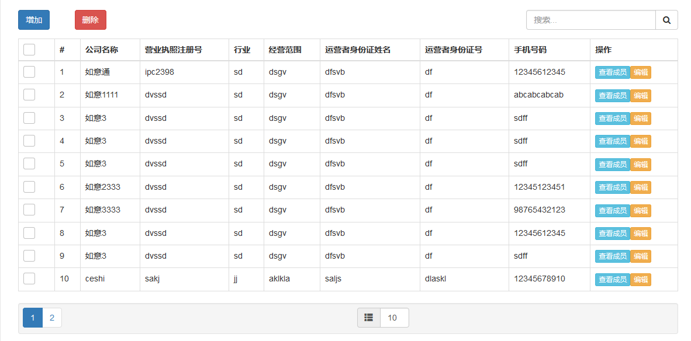
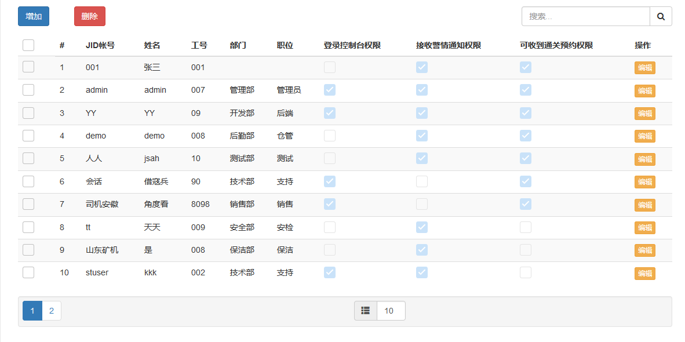
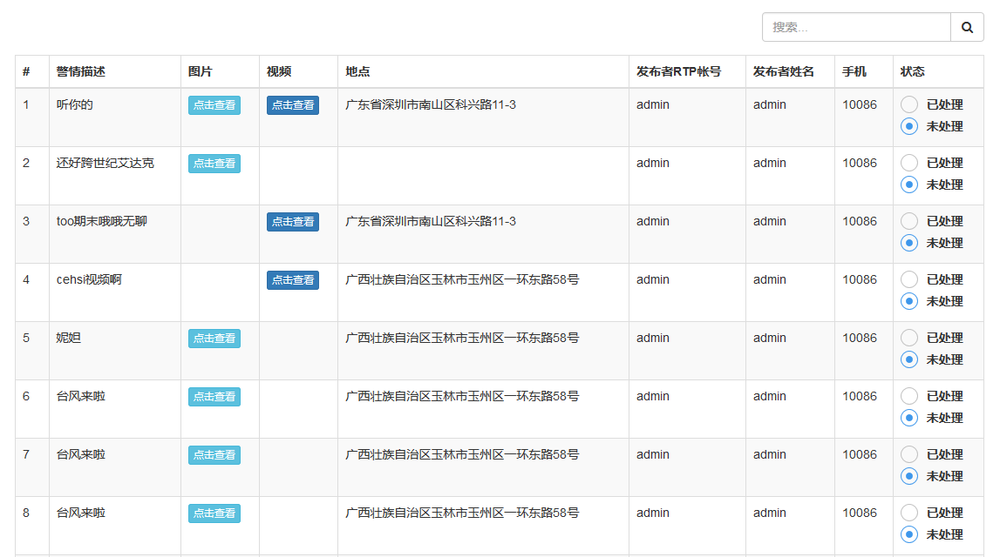

bs_grid
=======

forked from pontikis/bs_grid [https://github.com/pontikis/bs_grid]

add features : checkbox, searchText ...

Use
---
```javascript
function initTable() {
	var edit_td = '<button class="btn btn-warning btn-xs" name="edit" type="button" onClick="updateStationuser(event)">编辑</button>';
	var ac_login_td = '<input type="checkbox" class="magic-checkbox" disabled="disabled" id="ac_login"><label for="ac_login"></label>';
	$("#table").bs_grid({
		ajaxFetchDataURL: "/rest/user/get",
        row_primary_key: "id",
		pageNum: 1,
		rowsPerPage: 10,
		maxRowsPerPage: 100,
		enableBox: true,
		enableTools: false,
		searchText: function() {
			var st = $("#tsb").val();
			return st;
		},
		rowSelectionMode: "multiple", // "multiple", "single", false
		columns: [ 
		            {field: "fullname", header: "姓名"},
		            {field: "number", header: "工号"},
		            {field: "department", header: "部门"},
		            {field: "position", header: "职位"},
		            {field: "", header: "登录权限", is_function: "yes", "td_content" : ac_login_td},
		            {field: "", header: "操作", is_function: "yes", "td_content" : edit_td},
		            {field: "id", header: "id", visible: 'no'}
		         ],
		useFilters: false,
		showRowNumbers: true,
		showSortingIndicator: false,
		useSortableLists: false,
		paginationOptions: {
		    containerClass: "well pagination-container",
		    visiblePageLinks: 5,
		    showGoToPage: true,
		    showRowsPerPage: true,
		    showRowsInfo: false,
		    showRowsDefaultInfo: false,
		    disableTextSelectionInNavPane: false
		  },
	    noResultsClass: "alert alert-warning no-records-found",
	    dataTableClass: "table table-striped table-hover",
		onDisplay: function() {
			$("#tools_table").remove();
		},
		onCellClick: function(event, data) {
			var $box = $("#box" + ++data.row);
			var check = $box.prop("checked");
			if (check) {
				$box.prop("checked", false).closest("tr").removeClass("bg-danger");
			} else {
				$box.prop("checked", true).closest("tr").addClass("bg-danger");
			}
		}
	});
}
```

Documentation
-------------
[http://www.pontikis.net/labs/bs_grid/docs][DOCS]
[DOCS]: http://www.pontikis.net/labs/bs_grid/docs


Screenshots
-----------
demo:

 

  

  


old:

![bs_grid sample1][sample1]
[sample1]: https://raw.github.com/pontikis/bs_grid/master/screenshots/sample1.png
